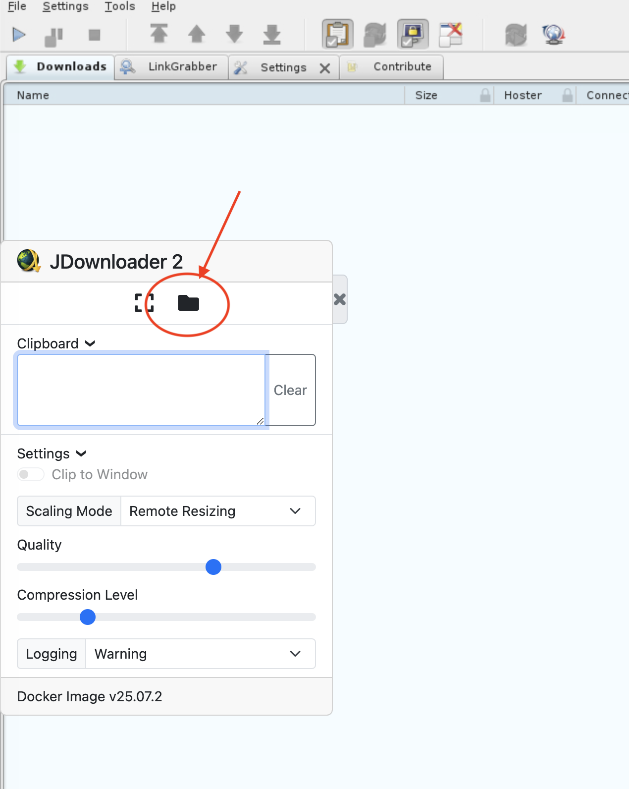

# jdownloader2 Helm Chart

From https://jdownloader.org/:
> JDownloader is a free, open-source download management tool with a huge community that makes downloading as easy and fast as it should be. Users can start, stop or pause downloads, set bandwith limitations, auto-extract archives and much more. It's an easy-to-extend framework that can save hours of your valuable time every day!

## Get Repo Info

    helm repo add my-jdownloader https://pmoscode-helm.github.io/jdownloader2/
    helm repo update

## Install chart

    helm install [RELEASE_NAME] my-jdownloader/jdownloader2

The command deploys jdownloader2 on the Kubernetes cluster in the default configuration.

See configuration below.

See [helm install](https://helm.sh/docs/helm/helm_install/) for command documentation.

## Uninstall Chart

    helm uninstall [RELEASE_NAME]

This removes all the Kubernetes components associated with the chart and deletes the release.

See [helm uninstall](https://helm.sh/docs/helm/helm_uninstall/) for command documentation.

## Upgrading Chart

    helm upgrade [RELEASE_NAME] [CHART] --install

See [helm upgrade](https://helm.sh/docs/helm/helm_upgrade/) for command documentation.

## Using the Web File Manager

If the web file manager is enabled, you will find it here:

## Values

| Key | Type | Default | Description |
|-----|------|---------|-------------|
| additionalVolumeMounts | list | `[]` | mountpoint(s) of the additional volumes inside the container |
| additionalVolumes | list | `[]` | additional volume(s) to mount into the container |
| image.pullPolicy | string | `"Always"` | pull policy |
| image.repository | string | `"jlesage/jdownloader-2"` | repository with jdownloader2 image |
| image.tag | string | `nil` | current version of the image |
| imagePullSecrets | list | `[]` | imagePullSecrets (not needed, if default image is used) |
| ingress | object | `{"annotations":{},"className":"","enabled":false,"hosts":[{"host":"chart-example.local","paths":[{"path":"/","pathType":"ImplementationSpecific"}]}],"tls":[]}` | Configure ingress for the "web" service. Only considered, if "service.web" is enabled |
| myjd.email | string | `""` | if "service.myjd" is enabled, the email address of the myJdownloader account is required |
| myjd.existingSecretName | string | `""` | use existing myjd secret (its data has to contains the keys: "email" and "password") |
| myjd.password | string | `""` | if "service.myjd" is enabled, the password of the myJdownloader account is required |
| persistence.accessMode | string | `"ReadWriteOnce"` | accessMode |
| persistence.enabled | bool | `false` | enable persistence when true |
| persistence.existingClaim | string | `""` | use an existing claim |
| persistence.size | string | `"20Gi"` | default storage size |
| persistence.storageClass | string | `""` | actual storageClass |
| service.myjd | object | `{"enabled":false,"port":3129}` | enable my.jdownloader.org remote connection |
| service.myjd.enabled | bool | `false` | enable "myJD" service |
| service.myjd.port | int | `3129` | exposed port of the service |
| service.vnc | object | `{"enabled":false,"port":5900}` | enable VNC connection (via VNC client) |
| service.vnc.enabled | bool | `false` | enable "VNC" service |
| service.vnc.port | int | `5900` | exposed port of the service |
| service.web | object | `{"enabled":true,"port":5800,"type":"LoadBalancer"}` | enable the web interface (via browser) |
| service.web.enabled | bool | `true` | enable "web" service |
| service.web.port | int | `5800` | exposed port of the service |
| service.web.type | string | `"LoadBalancer"` | service type (only used when ingress.enabled: false) |
| serviceAccount.annotations | object | `{}` | add annotations to serviceAccount |
| serviceAccount.create | bool | `true` | enable serviceAccount |
| serviceAccount.name | string | `""` | name of the serviceAccount (will be generated if empty) |
| webFileManager.allowedPaths | string | `"AUTO"` | a comma-separated list specifies which paths within the container are accessible (commonly used folders and any folders mapped to the container) |
| webFileManager.deniedPaths | string | `""` | a comma-separated list specifies which paths within the container are not accessible (takes precedence over the ones configured in "allowedPaths") |
| webFileManager.enabled | bool | `false` | enable the build-in web file manager |

## Maintainers

| Name | Email | Url |
| ---- | ------ | --- |
| pmoscode | <info@pmoscode.de> | <https://pmoscode.de> |

## Contributing

If you want to add features or bugfixes, please open an issue (either feature or bug) and provide also an unittest (https://github.com/helm-unittest/helm-unittest).
To make things easier, you can use Taskfile (https://taskfile.dev/) to get a small shortcut for some useful commands.

You also need to copy the ".env-template" file as ".env" and configure it for your needs.

The Taskfile itself needs this tools to run the tasks:
- https://github.com/helm/chart-releaser
- https://helm.sh/docs/intro/quickstart/
- https://github.com/mbenabda/helm-local-chart-version (install it outside an GIT repo!)
- https://github.com/norwoodj/helm-docs
- https://github.com/helm-unittest/helm-unittest/
- https://github.com/pawamoy/git-changelog
